<div align="center">

# AI-SRE

### An AI told me a server died of memory exhaustion. It didn't.

**An autonomous on-call agent that investigates real incidents — and the measurement infrastructure that proves how often it lies about them.**

[](eval/RESULTS.md)
[](eval/RESULTS.md)
[](eval/RESULTS.md)
[](eval/PREREGISTRATION.md)
[](LICENSE)

[Reproduce the numbers](#reproduce-everything-in-30-seconds) ·
[The result](#the-result-that-matters) ·
[Architecture](#architecture) ·
[What broke](#three-times-this-project-caught-itself)

</div>

---

## The thirty-second version

An LLM agent watches a service, notices it break, investigates with real tools
(`docker inspect`, `docker logs`, `git log`), writes a root-cause analysis, and waits for
a human to approve a fix.

On incident #3, it reported the container had been **OOM-killed with exit code 137 after
3 restarts.**

The container had exit code `0` and had never restarted. None of it was real.

It happened again, unprompted, months later — on incident #7 the model asserted the same
fabricated numbers **without ever calling the tool that reports them**, while correctly
diagnosing the actual cause in the same breath.

That failure is not a bug to be fixed. It is the thing this repository is about.

---

## The result that matters

A checker was built to catch exactly that fabrication. Then it was measured properly —
predictions [committed before the run](eval/PREREGISTRATION.md), labels generated
mechanically, never hand-scored.

| Checker | Corpus | Recall | False positives |
|---|---|:---:|:---:|
| **v0** — two regexes | 9 designed classes (n=180) | `33.3%` | `0%` |
| **v1** — evidence grounding | 9 designed classes (n=180) | `100%` | `0%` |
| **v1** — *same checker* | 6 **held-out** classes (n=120) | **`0%`** | — |

> **The third row is the finding.** The 100% is not a detection capability. The same
> author wrote the mutation generator *and* the checker, so v1 was designed knowing the
> nine classes it would be graded on. That is a detector scoring itself on its own exam.

Six fabrication classes written *afterwards* caught **0 of 120**. Three of them contain no
fabricated token at all — they are false assertions built entirely from **true values**:

```diff
  Evidence retrieved:  { "running": true, "exit_code": 0, "restart_count": 0 }

- RCA claims:  "Container status shows running=False, confirming the process is stopped"
                                      ^^^^^^^^^^^^^
                    every token appears in the evidence. the assertion is its opposite.
                              → token-presence checking cannot see this
```

**This is a structural ceiling, not a gap to patch with more regexes.** Full method,
per-class breakdown and the miss list: **[`eval/RESULTS.md`](eval/RESULTS.md)**.

---

## Why a lying agent is still safe

The detector has 0% held-out recall. The system is still safe, because **detection was
never the control.**

```
model writes RCA  ──▶  human approves  ──▶  Atlas mints one-shot capability
                                                      │
                                              verify ─┤ REJECT / unreachable / expired
                                                      │        └──▶ nothing happens
                                                      ▼
                                          FIXED, ENUMERATED ACTION
                                          (restart. that's the whole action space.)
```

The model's `recommended_action` text is **never executed** — only displayed. A
hallucinated RCA produces a wrong *explanation*, never a wrong *action*. The blast radius
of a confident lie is bounded by construction rather than by detection working.

Deployed on AWS, that same bound is enforced **twice, independently**:

| Layer | Mechanism | Guarantee |
|---|---|---|
| Application | [Atlas](https://github.com/Raj-glitch-max/atlas) capability, 120s TTL, one-shot, revoked after use | Fail-closed — verified against 6 scenarios incl. Atlas being *unreachable* |
| Infrastructure | IAM permission boundary + condition refusing task-definition changes | `ecs:UpdateService` on **one** ARN. Cannot be widened by a later policy attach |

The agent's own task role is **explicitly denied** `ecs:UpdateService`. It has no path to
an action even if the application logic were wrong.

---

## Architecture

```mermaid
flowchart LR
    subgraph detect [" "]
        P[poller<br/>5s health check] -->|500| I[(incident<br/>opened)]
    end

    subgraph investigate [" "]
        I --> A[LLM agent<br/>tool-calling loop]
        A <-->|docker inspect<br/>docker logs<br/>git log| T[real tools]
        A --> R[RCA + evidence<br/>+ tool transcript]
    end

    subgraph verify [" "]
        R --> F[faithfulness checker<br/>claims vs evidence]
    end

    subgraph act [" "]
        R --> H{human<br/>approves?}
        H -->|yes| X[Atlas capability<br/>issue → verify → revoke]
        X -->|ACCEPT| FA[fixed action:<br/>restart]
        X -->|anything else| N[nothing happens]
        H -->|no| N
    end

    FA --> V[verify healthy]

    style F stroke-dasharray: 5 5
    style N fill:#402,stroke:#f66
    style FA fill:#040,stroke:#6f6
```



The faithfulness checker is **dashed on purpose**: it observes and reports, it does not
gate. Conflating a quality measurement with a safety control would build a second,
redundant, and much weaker safety mechanism where a measurement tool was asked for.

---

## Reproduce everything in 30 seconds

No API key. No cloud account. No cluster.

```bash
git clone https://github.com/Raj-glitch-max/AISRE.git && cd AISRE
make reproduce
```

Re-derives every headline number in this README from committed code and data, and exits
non-zero if any has drifted. It is wired into CI, so a claim that stops being true breaks
the build.

<details>
<summary><b>Run the agent against a live incident</b> (needs Docker + an NVIDIA NIM key)</summary>

```bash
echo "NIM_KEY=nvapi-..." > .env

cd victim-app && docker build -t victim-app . \
  && docker run -d -p 8000:8000 --name victim-app victim-app && cd ..

cd backend && python -m venv venv && source venv/bin/activate \
  && pip install -r requirements.txt && python migrate_db.py \
  && uvicorn main:app --port 9000
```

Open `http://localhost:9000/dashboard/`, hit **BREAK VICTIM-APP**, and watch an agent
open an incident, investigate it with real tools, and stop for your approval.

Then check whether it told you the truth:

```bash
python faithfulness_eval.py <incident_id>
```
</details>

<details>
<summary><b>Deploy it to AWS</b> (~$50–150/month — read this before running it)</summary>

```bash
cd infra
export TF_VAR_nim_api_key=nvapi-...
terraform init && terraform plan -out=tf.plan
terraform apply tf.plan
```

59 resources: ECS Fargate, ALB, RDS Postgres, Step Functions approval gate, Cloud Map
private DNS, scoped IAM, S3, Secrets Manager, CloudWatch alarms, budget alarm.

**`terraform destroy` when you're done.** NAT Gateway (~$32/mo), RDS (~$13/mo) and ALB
(~$16/mo) bill whether or not you're looking. See [`infra/README.md`](infra/README.md).
</details>

---

## Three times this project caught itself

The reason to read this repository is not that the code works. It is the failure log.

| # | What was claimed | What was actually true | How it was caught |
|:--:|---|---|---|
| 1 | Agent: *"OOM-killed, exit 137, 3 restarts"* | `exit_code 0`, `restart_count 0` | Reproduced live on incident #7 — where it never even called the tool |
| 2 | Checker: *"catches fabrications"* — 100% | Fit to its own test set | 6 held-out classes → **0 of 120** |
| 3 | Checker: *"0% false positives"* | 5 false positives on real output | Synthetic negatives were too clean; one real incident broke it |

Each one is the same lesson at a different altitude: **a result measured on data you
generated yourself is a result about yourself.** The sibling project
[KLRB](https://github.com/Raj-glitch-max/kubernetes-llm-incident-response-benchmark)
learned it the hardest way — its headline finding turned out to be its own prompt leaking
the answer.

The full engineering log, including every failure and the reasoning behind each decision,
is in **[`flow.md`](flow.md)**.

---

## What this project does *not* claim

Stated plainly, because the alternative is the failure mode above:

- ❌ It does **not** "detect hallucinations." It detects a subset of value-level
  fabrications in extracted claim shapes.
- ❌ Any recall number without a named corpus is meaningless. `100%` and `0%` are the
  same checker.
- ❌ The victim service is a toy. The action space has exactly one member.
- ✅ What *is* claimed: a hallucinated RCA cannot cause a wrong action, and that property
  does not depend on the detector working.

---

## Repository map

| Path | What's in it |
|---|---|
| [`backend/`](backend/) | Poller, agent loop, faithfulness checker, Atlas gate, dashboard |
| [`eval/`](eval/) | Preregistration, mutation generators, held-out classes, **results** |
| [`infra/`](infra/) | Terraform — the interesting file is [`iam.tf`](infra/iam.tf) |
| [`victim-app/`](victim-app/) | The service that breaks on demand |
| [`flow.md`](flow.md) | Full engineering log, every phase, every failure |
| [`frontend-changes.md`](frontend-changes.md) | Parked UI work |

### Related projects

| | |
|---|---|
| **[Atlas](https://github.com/Raj-glitch-max/atlas)** | The SPIFFE capability primitive that gates remediation here. Formally specified, conformance-tested, offline-verifiable |
| **[KLRB](https://github.com/Raj-glitch-max/kubernetes-llm-incident-response-benchmark)** | Chaos-injection benchmark measuring whether LLMs read telemetry or pattern-match priors — and a case study in a benchmark manufacturing its own result |

---

<div align="center">

**[Read the measured results →](eval/RESULTS.md)**

MIT licensed · built by [Raj Patil](https://github.com/Raj-glitch-max)

</div>
